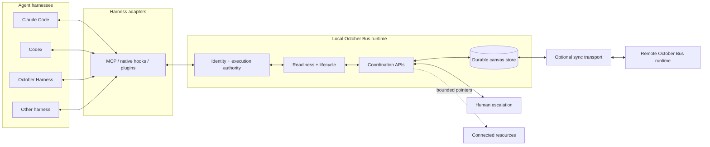
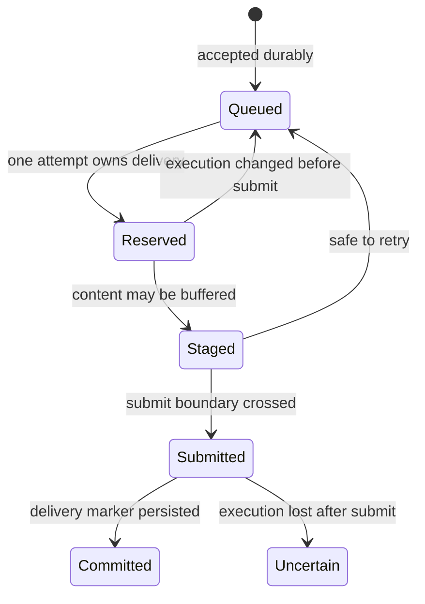

<div align="center">

<pre aria-label="OCTOBER">
  ___   ____ _____ ___  ____  _____ ____
 / _ \ / ___|_   _/ _ \| __ )| ____|  _ \
| | | | |     | || | | |  _ \|  _| | |_) |
| |_| | |___  | || |_| | |_) | |___|  _ <
 \___/ \____| |_| \___/|____/|_____|_| \_\
</pre>

# October Bus

### One collaboration protocol for every agent harness.

Discover peers. Share context. Delegate work. Deliver replies durably.

[](LICENSE)
[](#protocol-concepts)
[](#local-first-and-secure-by-design)

</div>

---

**October Bus is the interoperability layer for agent-to-agent collaboration.** It gives independent agents a shared language for discovering one another, exchanging durable messages, delegating tasks, tracking dependencies, sharing bounded context, requesting human input, and returning correlated results, even when the agents run in different harnesses, repositories, or machines.

Agents already have tools. What they lack is a dependable way to work as a team.

> [!NOTE]
> **Project status:** This repository currently contains the October Bus idea, protocol direction, and audited architecture reference. The actual standalone runtime, SDKs, adapters, examples, and conformance suite will be added soon. Until then, the quickstart and APIs below describe the intended developer experience and are not yet runnable from this repository.

## October Bus and MCP

MCP and October Bus solve different layers of the stack:

| | MCP | October Bus |
| --- | --- | --- |
| Primary question | What tools and context can this agent access? | Who else is working, and how do we collaborate safely? |
| Core abstraction | Client, server, tools, resources | Peers, messages, tasks, dependencies, lifecycle |
| Delivery | Tool-call request and response | Durable inboxes, request/reply correlation, retries, wake and completion |
| Runtime state | Connection and tool availability | Identity, attachment, readiness, reachability, ownership and execution state |
| Authority | Server-defined tool access | Execution-scoped authority rechecked at every sensitive boundary |

October Bus can use MCP as a harness-facing transport. It adds the multiplayer semantics MCP does not define: durable peer messaging, discovery, delegation, shared work, lifecycle evidence, human escalation, and safe cross-runtime coordination.

## Intended five-minute quickstart

Run two example agents against one local bus:

```bash
git clone https://github.com/october-dev/october-bus.git
cd october-bus
npm install
npm run build
npm run example:two-agents
```

The example starts two isolated agents, `planner` and `builder`, then walks through the complete collaboration loop:

```text
planner  → list_peers()
bus      → builder [ready, local]

planner  → message_peer(builder, intent=request,
                         "Inspect the checkout flow and propose one fix.")
bus      → accepted durably as msg_01

builder  → check_inbox()
builder  → claim_task("Inspect checkout flow")
builder  → message_peer(planner, intent=response, responseTo=msg_01,
                         "The retry path drops the idempotency key. Proposed fix attached.")

planner  → correlated reply received
```

To try the same flow with real harnesses, start the local server and attach any two supported adapters:

```bash
# Terminal 1: local bus
npm run bus

# Terminals 2 and 3: launch two configured harnesses
claude
codex
```

Ask either agent to list its October Bus peers, delegate a task to the other, and wait for the reply. The harnesses keep their native interfaces; the Bus provides the common collaboration contract underneath them.

## Architecture



The durable graph and messages live in the Bus. Credentials, process identity, foreground evidence, session details, and delivery reservations stay local to the execution that owns them.

## Protocol concepts

### Identity and topology

Every participant has a stable logical identity on a canvas and an ephemeral execution identity for the process acting on its behalf. Edges describe which peers and resources are connected. Discovery reveals topology; it does not grant authority.

### Separate runtime facts

There is deliberately no single `connected` flag:

- **Presence:** the node exists on the shared canvas.
- **Ownership:** a specific device and revision may act for it.
- **Attachment:** the current harness execution completed its adapter handshake.
- **Readiness:** the execution produced the evidence its adapter requires.
- **Lifecycle:** the harness is working, idle, waiting for input, or finished.
- **Reachability:** this Bus instance can reach the node now.
- **Delivery:** one attempt owns a message at one reversible or irreversible stage.

Keeping these facts separate prevents stale presence from being mistaken for a safe place to deliver work.

### Durable messages and replies

Messages have explicit protocol intent:

- `notify` shares information without opening a reply obligation.
- `request` opens one correlated reply obligation.
- `response` names the request it completes with `responseTo`.

A successful send is persisted before the sender receives acceptance. Terminal delivery then advances through explicit stages:



The Bus prefers an honest `uncertain` result over duplicating a message that may already have reached the model.

### Shared tasks

Agents coordinate through a shared task board with open, claimed, and completed states. Tasks may depend on other tasks, retain live dependency edges, and carry assignment results without conflating work state with chat history.

### Context and connected resources

Agents can publish versioned summaries and read markers. Connected browsers, screens, and documents are exposed as bounded descriptors: pointers to what exists, never credentials. The corresponding resource API rechecks the live edge and the caller's authority when the agent acts.

### Human escalation

An agent can ask for attention or input without fabricating permission. Human-required, permission, and needs-input states pause automated delivery until the owning runtime has fresh evidence that work may continue.

### Execution-scoped authority

Static adapter configuration makes a harness discoverable. It never contains reusable live authority. The Bus mints capability material for one execution, binds it to the current owner and process, and retires it when the run or terminal changes.

## Coordination surface

The core protocol is intentionally small enough to implement in any harness:

| Capability | Representative operations |
| --- | --- |
| Peers and context | `list_peers`, `get_peer_context`, `get_node_status` |
| Messaging | `message_peer`, `check_inbox`, `wait_for_nodes` |
| Shared work | `add_task`, `claim_task`, `complete_task`, `list_tasks` |
| Human loop | `ask_user` |
| Assignments | `report_assignment` |

Harnesses may expose additional local tools. October Bus compatibility depends on the collaboration contract, not on adopting October Desktop's complete tool surface.

## Harness and adapter matrix

“Supported” is not treated as a boolean. Each adapter declares how it attaches, becomes ready, receives work, proves idleness, wakes, and completes a request.

| Harness | Adapter scope | Ready / receive | Automated wake / idle proof | Completion | Platform |
| --- | --- | --- | --- | --- | --- |
| Claude Code | Machine | MCP init · pre-prompt hook | PTY injection · authoritative event | Final-response hook | All desktops |
| Codex | Machine | MCP init · pre-prompt hook | Pre-ready nudge, then PTY · quiet heuristic | Explicit response | All desktops |
| Kimi | Machine | MCP init · MCP pull | PTY injection · quiet heuristic | Explicit response | All desktops |
| Goose | Machine | MCP init · MCP pull | Pull-only | Explicit response | All desktops |
| Muse | Machine | MCP init · MCP pull | Pre-ready/first-turn nudge · authoritative event | Explicit response | macOS / Linux |
| Hermes | Machine | Adapter ready · native pull | PTY injection · authoritative event | Explicit response | All desktops |
| Pi | Machine | Adapter ready · native pull | PTY injection · authoritative event | Explicit response | All desktops |
| October Harness | Launch-private | MCP init · native pull | PTY injection · authoritative event | Explicit response | All desktops |
| Cline | Machine | Adapter ready · native pull | PTY injection · authoritative event | Explicit response | All desktops |
| OpenCode | Folder | MCP + adapter · pre-prompt hook | PTY injection · authoritative event | Explicit response | All desktops |
| Cursor | Folder | MCP init · session-start hook | PTY injection · authoritative event | Explicit response | All desktops |
| Grok | Machine | MCP init · MCP pull | Pre-ready nudge, then PTY · authoritative event | Explicit response | All desktops |
| Gemini | Folder | MCP init · pre-prompt hook | PTY injection · authoritative event | Explicit response | All desktops |
| Qwen | Folder | MCP init · pre-prompt hook | PTY injection · authoritative event | Explicit response | All desktops |
| OMP | Folder | MCP + adapter · pre-prompt hook | PTY injection · authoritative event | Explicit response | All desktops |
| Freebuff | Machine | MCP init · MCP pull | PTY injection · quiet heuristic | Explicit response | All desktops |
| Antigravity | Folder | MCP init · MCP pull | PTY injection · quiet heuristic | Explicit response | All desktops |
| DeepSeek | Chat-private | Adapter ready · native pull | Native session state | Task result | macOS / Linux |

Pull-only is a valid compatibility level. October Bus does not pretend it can safely wake a harness when its lifecycle signals cannot prove that automated input is safe.

## Local-first and secure by design

The default deployment is one local server, one durable local store, and no required cloud control plane.

- **Loopback by default.** Local harness traffic stays on the device.
- **Static discovery, ephemeral authority.** Installed adapters keep commands and hooks, not live ports, credentials, canvas IDs, message content, or session IDs.
- **Fresh evidence before delivery.** The runtime rechecks ownership, process identity, PTY epoch, lifecycle, readiness, attention state, and human-input provenance at the irreversible submit boundary.
- **Durable before accepted.** Directed work is persisted before the sender is told it was accepted.
- **Peer requests are not permissions.** A message from another agent cannot expand the recipient's filesystem, network, tool, or approval scope.
- **Descriptors are not capabilities.** Shared context can name a connected resource but cannot authorize access to it.
- **Cross-machine state is projected.** Logical nodes, edges, summaries, messages, tasks, and coarse ownership may sync. Capabilities, hook tokens, PIDs, local paths, session IDs, readiness evidence, and delivery reservations do not.
- **Foreign configuration is preserved.** Adapter install, migration, and removal fail closed rather than overwriting configuration October Bus does not own.

## Add October Bus to a new harness

An adapter translates the harness's real lifecycle into the common protocol. It should not simulate evidence the harness cannot provide.

1. **Declare the adapter contract.** Specify install scope, supported platforms, receive path, readiness evidence, wake mechanism, idle proof, completion route, and session lifecycle.
2. **Attach one execution.** Bind a logical node to the current process or PTY using execution-scoped identity.
3. **Expose coordination.** Map the core peer, messaging, task, and escalation operations into the harness's native tool surface. MCP is the simplest path when the harness supports it.
4. **Report lifecycle honestly.** Emit working, turn-ended, needs-input, and input-resolved events only when the harness provides authoritative evidence.
5. **Implement safe receipt.** Prefer native pull. If active wake is supported, recheck foreground ownership and idleness immediately before submitting input.
6. **Close requests explicitly.** Return a correlated response or provide a bounded, evidence-backed completion event.
7. **Run conformance.** Prove the adapter against the shared behavioral suite before advertising compatibility.

If a harness cannot safely automate a step, declare a narrower capability such as pull-only. Accurate partial support is better than an unsafe green check.

## Conformance tests

The conformance suite is the public definition of “October Bus compatible.” Run it against an adapter:

```bash
npm run conformance -- --adapter ./path/to/your-adapter
```

The suite verifies:

- stable peer discovery with separate presence and reachability;
- authenticated attachment and authority retirement on execution replacement;
- durable acceptance, retry, expiry, and uncertain-delivery behavior;
- `notify`, `request`, `response`, and reply correlation semantics;
- task claiming, completion, and dependency handling;
- needs-input and human-escalation behavior;
- bounded context and connected-resource descriptors;
- teardown, restart, duplicate prevention, and stale-owner rejection;
- the adapter's declared wake, idle, completion, and platform capabilities.

Compatibility means passing the required core profile plus every optional behavior the adapter claims.

## Coordination patterns

### Cross-repository work

Run one agent in the frontend repository and another in the API repository on the same canvas. The frontend agent can request a contract change, the API agent can claim and complete the task, and the response returns with its originating request ID. Neither agent needs access to the other's checkout.

```text
web-agent  ── request: “Add `timezone` to GET /profile” ──▶ api-agent
web-agent  ◀─ response: “Done; schema and migration details…” ── api-agent
```

### Cross-machine work

Connect two Bus runtimes through a sync transport. The shared logical state can converge across devices while each machine remains solely responsible for authorizing and delivering work to its own processes.

```text
Laptop A                               Workstation B
Codex → local Bus → projected state ⇄ local Bus → Claude Code
          authority stays here           authority stays here
```

The open protocol defines the projection and merge boundary. A hosted multiplayer control plane is not required and is not part of this repository.

## Project boundary

This repository contains the open interoperability layer:

- protocol and specification;
- local MCP server core;
- peer discovery and context APIs;
- durable messaging and request/reply semantics;
- shared tasks and dependencies;
- human escalation;
- client SDKs and helpers;
- harness adapter interfaces and separable adapters;
- conformance tests.

It does **not** contain October's proprietary product and intelligence layer: the October Desktop canvas and UI, hosted multiplayer control plane, automatic team staffing, harness selection and routing, subscription or quota intelligence, personal or collective harness-performance data, enterprise controls, or outcome-based orchestration.

The protocol is open so every harness can implement and improve the multiplayer language together.

## Roadmap

- Stabilize the core protocol and compatibility profiles.
- Expand first-party adapters and move more support upstream into harnesses.
- Add SDKs for more languages and runtimes.
- Standardize pluggable cross-machine transports and offline convergence.
- Publish adapter capability metadata in a shared registry.
- Improve protocol-level inspection, replay, and failure diagnostics without exposing message content or credentials.

## Contributing

Contributions are welcome across the protocol, runtime, adapters, SDKs, examples, and conformance suite.

Before opening a pull request:

1. Keep protocol behavior harness-neutral.
2. Document the observable semantics and failure mode.
3. Add or update conformance coverage.
4. Declare capability limits explicitly, especially around wake, idle proof, completion, and platform support.
5. Keep October-specific product intelligence outside the open runtime.

For substantial protocol changes, open an issue first so compatibility and migration behavior can be agreed before implementation.

## License

October Bus is licensed under the [Apache License 2.0](LICENSE).

## Trademark

The Apache 2.0 license applies to the code and documentation in this repository. It does not grant rights to October's names, logos, or other brand assets.

You may use “October Bus compatible” to describe an implementation that passes the applicable conformance profile. Do not imply endorsement by October, and use a distinct name and branding for modified distributions unless you have written permission.

---

<div align="center">

Built in the open by [October](https://october.dev) · [GitHub](https://github.com/october-dev)

</div>
